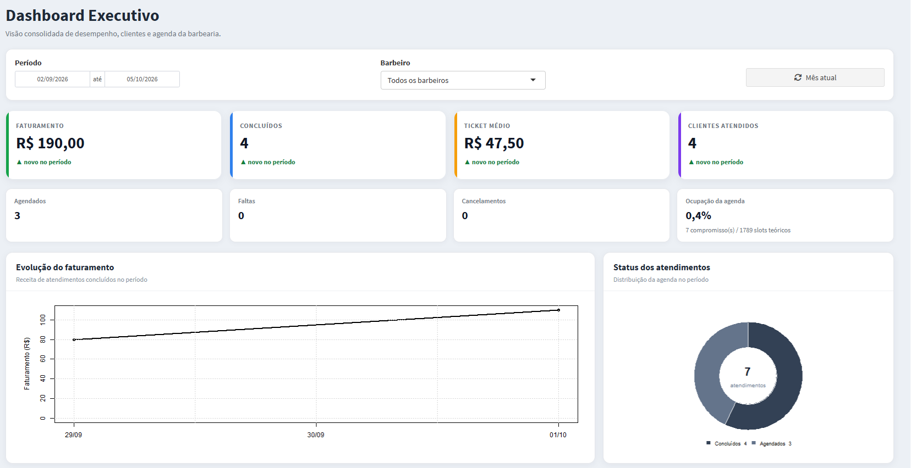
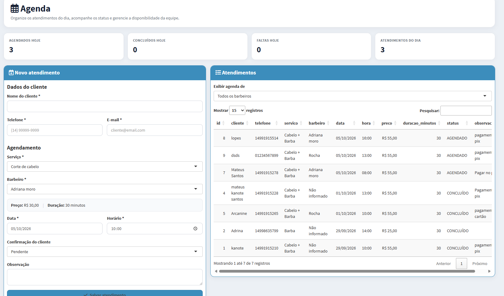
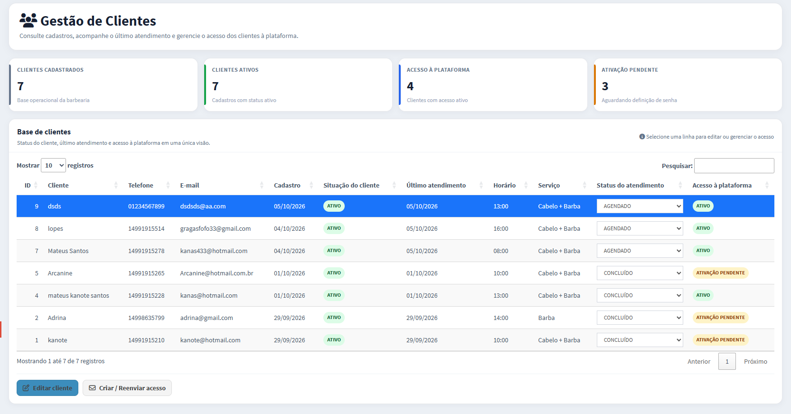
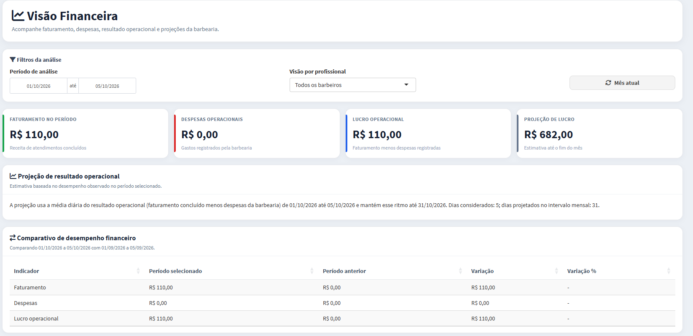

# 💈 Plataforma de Gestão para Barbearias

Plataforma web completa para gerenciamento de barbearias, desenvolvida em **R/Shiny** com **Microsoft SQL Server**.

O projeto foi desenvolvido com foco em centralizar a operação de uma barbearia em uma única aplicação, contemplando agendamentos, clientes, profissionais, serviços, controle financeiro, dashboards, autenticação e administração de múltiplas unidades.

## 🎯 Objetivo do projeto

Criar uma solução capaz de atender diferentes perfis de usuários e centralizar processos administrativos e operacionais de uma barbearia.

Além da construção das telas, o projeto envolveu modelagem de banco de dados, regras de negócio, controle de acesso, segurança, concorrência de agenda, auditoria, responsividade e sincronização de informações entre diferentes sessões.

## 🚀 Principais funcionalidades

- Gestão de múltiplas unidades
- Cadastro e gerenciamento de barbeiros
- Cadastro e gerenciamento de clientes
- Página pública da barbearia
- Criação de conta pelo próprio cliente
- Autoagendamento
- Agenda por profissional
- Configuração individual de jornada dos barbeiros
- Configuração de horário de funcionamento da unidade
- Bloqueio de horários
- Controle de disponibilidade
- Gestão de serviços, preços e duração
- Controle de despesas
- Indicadores financeiros
- Dashboards gerenciais
- Histórico de alterações
- Recuperação de senha por e-mail
- Interface responsiva para desktop e dispositivos móveis
- Sincronização automática das informações entre sessões

## 👥 Perfis de acesso

A aplicação trabalha com diferentes níveis de acesso:

### MASTER

Responsável pela administração geral da plataforma, incluindo gestão das unidades e usuários.

### BARBEIRO

Possui acesso às funcionalidades operacionais relacionadas à unidade, agenda, clientes e atendimentos.

### CLIENTE

Pode criar sua própria conta, acessar a plataforma e realizar agendamentos de acordo com a disponibilidade dos profissionais.

## 📅 Sistema de agenda

A disponibilidade de horários é calculada considerando diferentes regras de negócio:

1. Horário de funcionamento da unidade
2. Jornada individual do barbeiro
3. Bloqueios gerais da barbearia
4. Bloqueios específicos do profissional
5. Horários já ocupados
6. Status dos agendamentos

Dessa forma, o sistema evita conflitos de horários para o mesmo profissional, mantendo agendas independentes entre barbeiros.

## 🏢 Arquitetura multiunidade

O sistema foi desenvolvido para trabalhar com múltiplas barbearias utilizando o mesmo banco de dados.

Os registros são associados à respectiva unidade por meio de identificadores, permitindo o isolamento lógico das informações de cada barbearia.

Essa estrutura possibilita que diferentes unidades utilizem a mesma aplicação sem compartilhar indevidamente seus dados operacionais.

## 🔄 Sincronização entre sessões

A plataforma possui mecanismo de atualização automática para que alterações realizadas por um usuário possam aparecer nas demais sessões abertas.

Para evitar atualizações desnecessárias da interface, foi implementado um controle de versão das alterações no banco.

A aplicação verifica periodicamente esse controle e somente dispara atualizações reativas quando identifica uma alteração real nos dados.

## 🗑️ Soft Delete

Determinadas informações utilizam **soft delete**.

Em vez de remover fisicamente o registro imediatamente, o sistema registra informações como status da exclusão, usuário responsável e data/hora.

Isso permite preservar histórico e rastreabilidade sem manter o registro ativo na operação.

## 🔐 Segurança

Algumas práticas utilizadas no projeto:

- Hash de senhas
- Controle de acesso por perfil
- Separação de configurações sensíveis por variáveis de ambiente
- Recuperação de senha com token temporário
- Validação de usuários ativos
- Isolamento lógico de dados por unidade
- Queries parametrizadas
- Transações para operações críticas
- Registro de histórico de alterações

Credenciais e configurações privadas **não são armazenadas diretamente no código público deste repositório**.

## 🗄️ Banco de dados

A aplicação utiliza **Microsoft SQL Server**.

A comunicação entre R e SQL Server é realizada principalmente através de:

- `DBI`
- `odbc`

O projeto utiliza consultas SQL parametrizadas e transações em operações que precisam manter consistência entre diferentes tabelas.

A aplicação também passou por um processo de migração de **SQLite para SQL Server** durante sua evolução.

## 📊 Dashboard e financeiro

A plataforma possui indicadores gerenciais para acompanhamento da operação, incluindo informações relacionadas a:

- Atendimentos
- Produção
- Serviços
- Receita
- Despesas
- Resultado financeiro
- Comparações de desempenho
- Produção por profissional

## 📱 Responsividade

A interface foi adaptada para utilização tanto em computadores quanto em dispositivos móveis.

Foram realizados ajustes específicos de CSS para componentes como:

- Cards
- Tabelas
- Menus
- Formulários
- Botões
- Grids
- DataTables

## 🛠️ Tecnologias utilizadas

| Tecnologia | Utilização |
|---|---|
| R | Linguagem principal |
| Shiny | Aplicação web e reatividade |
| shinydashboard | Estrutura da interface administrativa |
| SQL Server | Banco de dados |
| SQL | Consultas e regras de persistência |
| DBI | Interface de acesso ao banco |
| ODBC | Conexão R ↔ SQL Server |
| DT | Tabelas interativas |
| sodium | Segurança e hash de senhas |
| blastula | Envio de e-mails |
| HTML/CSS | Customização e responsividade |
| Microsoft Dev Tunnels | Testes externos via HTTPS |
| Git/GitHub | Versionamento e portfólio |

## 🧠 Conceitos aplicados

Durante o desenvolvimento foram trabalhados conceitos como:

- Programação reativa
- CRUD
- Modelagem relacional
- Autenticação
- Autorização
- Multi-tenancy
- Transações SQL
- Soft delete
- Auditoria
- Validação de regras de negócio
- Controle de concorrência de agenda
- Variáveis de ambiente
- Migração de banco de dados
- Responsividade
- Sincronização entre sessões
- Versionamento de código

## 🏗️ Arquitetura simplificada

```text
Usuário
   │
   ▼
Interface Web
R / Shiny
   │
   ▼
Regras de negócio
   │
   ▼
DBI + ODBC
   │
   ▼
Microsoft SQL Server
```

Para testes externos:

```text
Internet
   │
   ▼
HTTPS / Dev Tunnel
   │
   ▼
Aplicação Shiny
   │
   ▼
SQL Server
```

O SQL Server permanece protegido no ambiente da aplicação e não precisa ser exposto diretamente à internet.

## ⚙️ Configuração

As informações sensíveis são configuradas por variáveis de ambiente.

Exemplo:

```text
APP_URL=https://seu-dominio.example
APP_PORT=3728

BARB_DB_DRIVER=ODBC Driver 18 for SQL Server
BARB_DB_SERVER=localhost
BARB_DB_DATABASE=Barbearia
BARB_DB_TRUSTED=yes

SMTP_FROM=seu_email@example.com
SMTP_USER=seu_email@example.com
SMTP_PASSWORD=sua_senha_de_aplicativo
```

> O arquivo `.Renviron` contendo credenciais reais não deve ser versionado.

## 📌 Status

**Versão 1 — funcional**

O projeto possui os principais fluxos administrativos e operacionais implementados.

Entre as evoluções possíveis estão melhorias de infraestrutura, implantação em ambiente de produção dedicado, testes automatizados, modularização adicional da aplicação e evolução da estratégia de sincronização.

## 👨‍💻 Autor

**Mateus Santos**

Projeto desenvolvido para aplicação prática de desenvolvimento de software, banco de dados, análise de dados, automação e construção de soluções utilizando R.

### Principais competências demonstradas

`R` • `Shiny` • `SQL` • `SQL Server` • `DBI` • `ODBC` • `Data Analysis` • `Dashboards` • `Git` • `GitHub`

---

## 📸 Demonstração da plataforma

Abaixo estão algumas das principais telas da plataforma em funcionamento.

### 📊 Dashboard gerencial

Visão consolidada dos principais indicadores da operação, permitindo acompanhar resultados e informações relevantes para a gestão da barbearia.




### 📅 Gestão da agenda

Agenda operacional utilizada para gerenciamento dos atendimentos, profissionais, horários e disponibilidade.




### 👥 Gestão de clientes

Área destinada ao gerenciamento das informações dos clientes cadastrados na plataforma.



### 💰 Gestão financeira

Painel financeiro para acompanhamento dos resultados da barbearia, receitas, despesas e indicadores gerenciais.




### ✂️ Gestão de serviços

Área utilizada para cadastro e gerenciamento dos serviços oferecidos pela barbearia, incluindo preços, duração e situação do serviço.


